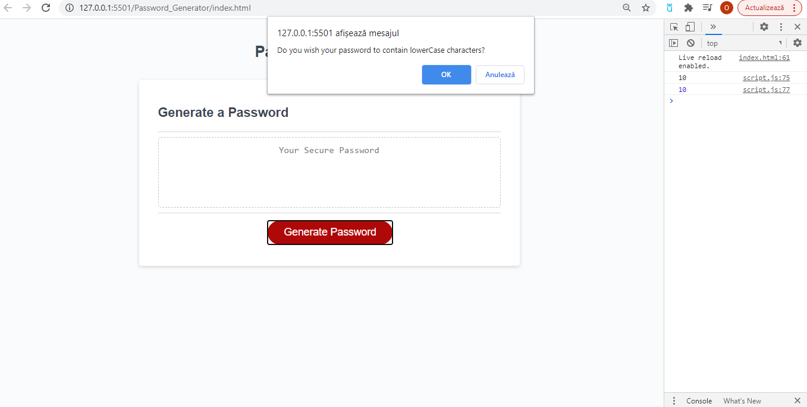
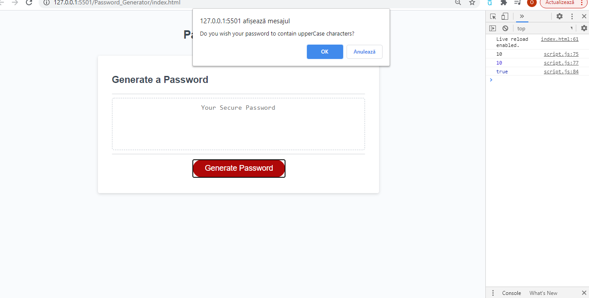
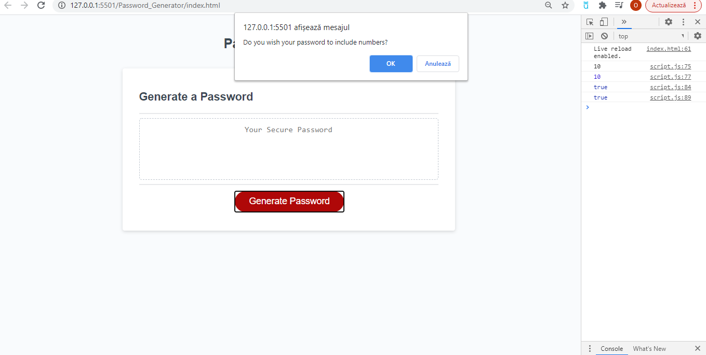
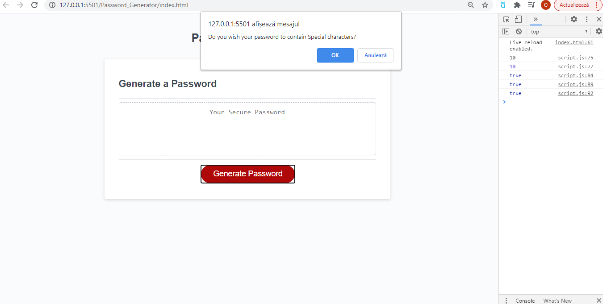

# Password_Generator

## Description

Following the user story that were given, as an employee with access to sensitive data, this password generate needs to randomly generate a password that meets certain criteria in order to create a strong password which will offer a more secure environment.We were given the html index alongside with the css style documents in order to create a password generator in JavaScript. By clicking on the button generate a password it should generate a secure password of at least 8 characters and no more than 128 characters, which will include lowercase, uppercase, numbers and special characters. In the case that the criteria is not meet a pop up box with the alert with show up. The final product should generate a password between 8-128 characters including lowerCase, upperCase, numbers and SpecialCharacters meeting the criteria in the user story and creating a secure environment.

### Link to the deployed application https://otivisan22.github.io/Password_Generator/

# Getting started

- Clone the GitHub project into your local machine
- Navigate into the project
- Open the project into VSCode
- Open the 'index.html' into your default browser

git clone git@github.com: git@github.com:otivisan22/Password_Generator.git
cd Password_Generator
code .

# What did we do?

- Created the JavaScript file
- Checked if the JavaScript file is linked to the html.index
- Declared the function that generates the password
- Declared the global variables
- Declared the prompt function which prompts the chosen variables
- Confirmed the global variables as chosen
- Each chosen character prompts a pop up box for confirmation
- If the criteria is not meet an alert will pop up
- Validation function for the type of character and for the new chosen variable
- Specify the random index for the chosen variable
- Fixed the error which has been encountered on the way of creating the password
- Formatted code using lint (prettier)
- Commented the steps that has been performed by adding comments

# Screenshots

# Testing

- A series of tests were performed in order to validated the prompts for the chosen characters

